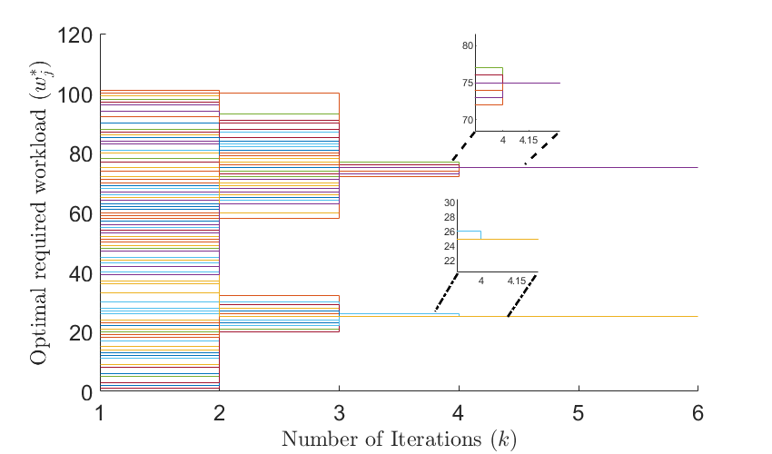
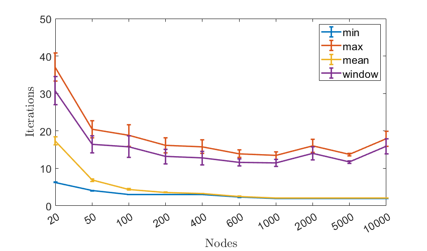
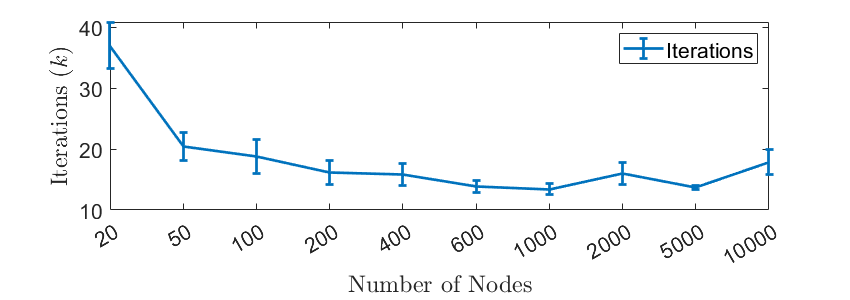
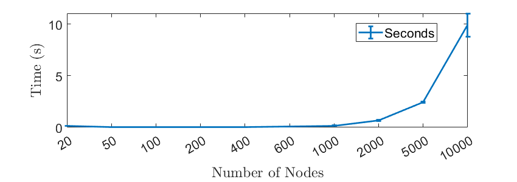

# Federated Quantized Capacity Ratio Consensus

In this paper we analyze the problem of optimal task scheduling for data 
centers. Task scheduling is an optimization problem in which workloads are
allocated to server machines such that a performance goal is optimized.
Given the available resources and tasks, we propose a fast distributed
iterative algorithm which operates over a large scale network of nodes
and allows each of the interconnected nodes to reach agreement to an
optimal solution in a finite number of time steps. More specifically, the
algorithm (i) is guaranteed to converge to the exact optimal scheduling
plan in a finite number of time steps and, (ii) once the goal of task
scheduling is achieved, it exhibits distributed stopping capabilities
(i.e., it allows the nodes to distributely determine whether they
can terminate the operation of the algorithm). Furthermore, the proposed
algorithm operates exclusively with quantized values (i.e., the
information stored, processed and exchanged between neighboring agents is
subject to deterministic uniform quantization) and relies on event-driven
updates (e.g., to reduce energy consumption, communication bandwidth,
network congestion, and/or processor usage). We also provide examples to
illustrate the operation, performance, and potential advantages of the
proposed algorithm. Finally, by using extensive empirical evaluations
through simulations we show that the proposed algorithm exhibits
state-of-the-art performance. 

<!-- capacity consensus example run -->

  

# Performance Quantification

<!-- capacity consensus example run -->

  

<!-- capacity consensus example run -->

  

  

